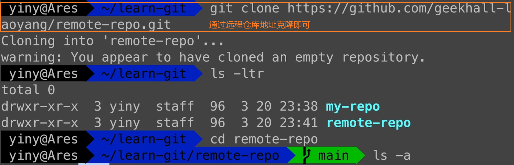

# Git入门

------

>[视频教程地址](https://www.bilibili.com/video/BV1HM411377j?p=1&vd_source=24c73db1380d47e0e9a380f78b9d0f00)

## 一、版本控制

1. **概念**：版本控制(Revision control )是一种在开发的过程中用于管理我们对文件、目录或工程等内容的修改历史，方便查看更改历史记录，备份以便恢复以前的版本的软件工程技术。——用于管理多人协同开发项目的技术。

   >版本控制：版本迭代---新的版本

2. **主流版本控制器**：

3. **分类**：

   - **本地版本控制**

   - **集中版本控制**（SVN）

     🌰所有的版本数据都存在服务器上，用户的本地只有自己以前所同步的版本，如果不连网的话，用户就看不到历史版本，也无法切换版本验证问题，或在不同分支工作。而且，所有数据都保存在单一的服务器上，有很大的风险这个服务器会损坏，这样就会丢失所有的数据，当然可以定期备份。代表产品:SVN、CVS、VSS。
     
   - **分布式版本控制**（Git）
   
     
   
     
   
     🌰每个人都拥有全部的代码；不会因为服务器损坏或网络问题造成不能工作的情况。
   
   - **Git 与 SVN 的区别**
   
     

## 二、初步使用

#### 1、安装

- **到官网或镜像网站下载安装文件**

  🌰官网：https://git-scm.com/

  🌰阿里镜像：https://registry.npmmirror.com/binary.html?path=git-for-windows/

- **检查卸载残留并安装**

  ①检查**环境变量**是否有与Git相关内容，有则删掉；

  ②直接卸载原有的Git软件；

  ③找到安装文件，无脑安装即可。

- **任意文件夹下右键 Git Bash 即可启动Git。**

  

- **一些基本Linux命令**

  

  

#### 2、初步配置

1. **检查Git是否安装成功**：出现版本号即为成功

   

2. **配置用户名和邮箱**：

   

   🌰**--global** 表示**全局配置**，对所有仓库生效；

   🌰由于上面用户名中间**含有空格**，所以需要用双引号括住；

   🌰第三行作用是**保存用户名和密码**，避免每次都输入；

   🌰用户名和密码只需要安装完Git后**配置一次**即可；

   🌰第四行命令作用是**查看Git的配置信息**

3. **创建本地仓库**：通常有两种方式，一种是**直接在本地创建**，另一种是**从远程克隆**一个仓库

   ① 本地创建一个仓库：找到一个合适位置创建一个空目录 → 进入这个目录，使用 `git init` 命令初始化为Git仓库（总仓库）→ 使用 `git init 指定名称` 在当前目录下创建一个新目录作为Git仓库

   

   

   ②远程克隆仓库到本地：直接利用 `git clone 仓库地址`命令克隆到本地即可

   

#### 3、Git 的使用

- **Git 的工作区域**

  

- **Git 管理的文件状态**

  

- **添加和提交文件**

  ①**查看仓库状态**：`git status`

  

  ②将文件**添加到暂存区**等待提交：`git add 文件名（可以在前面加上路径）`

  🌰使用通配符来暂存多个文件：`git add *.txt` 将所有txt文件提交到暂存区 

  🌰将当前文件夹下所有文件都添加到暂存区：`git add .`

  

  ③**提交到仓库**：`git commit -m "提交信息"`（若不使用 -m ，则会进入一个交互式界面，默认使用vim来编辑提交信息）

  

  ④**查看提交记录（历史）**：`git log`（查看简洁的提交信息：`git log --oneline` ）

  

- **撤销修改/回退版本**

  使用`git reset 版本ID` 命令（版本ID可以通过`git log --oneline` 查看），有三种模式：

  ① `git reset --soft`：回退到某一个版本，并保留工作区和暂存区所有修改内容

  ②`git reset --hard`：回退到某一个版本，丢弃工作区和暂存区所有修改内容

  ③`git reset --mixed`：回退到某一个版本，只保留工作区所有修改内容（**`git reset` 的默认参数**）

  🌰谨慎使用hard参数，若不小心误操作也是可以回溯的，通过`git reflog` 命令查看操作的历史记录，找到误操作之前的版本号，再使用git reset 命令回退到这个版本号即可。

  

- **`git diff` 命令**

  

  🌰`git diff`：比较工作区与暂存区之间的差异内容，显示发生更改的文件及更改的详细信息

  🌰`git diff HEAD`：比较工作区与版本库之间的差异内容

  🌰`git diff --cached`：比较暂存区与版本库之间的差异内容

  🌰`git diff 版本一ID 版本二ID`：比较两个版本之间的差异内容（或者使用版本ID和 HEAD 来进行比较，**HEAD 指向分支的最新提交节点，表示当前分支的最新提交**）

  🌰`git diff 分支一 分支二`：比较两个分支之间的差异内容

  

  

- **从版本库中删除文件**

  ①直接删除文件后提交：删除文件（rm 命令或者直接扔到回收站）→ 使用`git add .`或者`git add 被删除文件`命令更新暂存区 → 使用 `git commit -m ""` 命令提交更新

  ②使用`git rm 要删除文件名`命令直接删除（工作区和暂存区都会删除，若想保留工作区文件，则在rm后面添加 `--cached` 参数） → 使用`git commit -m ""` 命令提交更新（否则删除掉的文件在版本库中仍然存在）

- **.gitignore 文件**

  🌰作用：忽略一些不应该被加入到版本库中的文件

  

  🌰使用 `echo 需忽略文件名 > .gitignore` 命令将需要忽略的文件添加到 .gitignore 文件中

  

  🌰直接在 .gitignore 文件中添加 *.log 文件，把所有的日志文件全部忽略（其他类型的方法相同）

  

  

  🌰.gitignore 文件的匹配规则：https://git-scm.com/docs/gitignore

  🌰GitHub上有各种 .gitignore 文件的模板，可以直接使用：https://github.com/github/gitignore

#### 4、远程仓库

- **GitHub注册登录（略）**

- **SSH配置和克隆仓库**

  ①**克隆仓库**：搜索需要的仓库，找到`code`，根据SSH即可进行克隆（或者其他方式，最推荐SSH）

  🌰克隆代码：`git clone 仓库SSH地址`

  

  ②**创建自己的远程仓库**

  🌰点击左上角 logo 回到主页，点击绿色 new 按钮创建新仓库

  

  🌰填写各个选项，填写完成后即创建成功

  

  🌰两种方式的远程仓库地址：①**HTTPS**：本地push到远程仓库的时候需要验证用户名和密码；②**SSH**：推送时不需要验证用户名和密码，但是需要在GitHub上添加SSH公钥配置（**推荐使用**）

  ③**生成SSH秘钥**

  🌰在`git bash`中使用如下命令流程生成SSH秘钥：

  

  🌰输入密码后，使用 `ls -ltr`命令查看本地文件，使用`vi 公钥文件名`打开其中的公钥文件并复制其中内容

  

  🌰打开GitHub，点击右上角头像找到settings，找到SSH配置，new一个，将上面复制内容粘贴到key中，起个title即可

  

  🌰若是初次配置秘钥，则到上一步已经完成，若并非初次，则需要再多加一步命令添加五个文件

  

  🌰回到Git总仓库中，克隆仓库即可

  

  🌰仓库克隆完成，可以通过以下命令进行管理了

  

  推送更新内容：`git push <remote> <branch>`

  拉取更新内容：`git pull <remote>`

- **关联本地仓库和远程仓库**

  ①先在GitHub上创建一个新仓库，并复制仓库SSH地址

  ②进入本地需关联的仓库，使用`git remote add origin 仓库SSH地址`命令关联远程仓库（可以使用`git remote -v` 命令查看远程仓库（可以看到如 别名 origin 等内容））

  ③使用`git branch -M main`命令指定分支的名称为main（若分支名已经是main则可以省略这一步）

  ④使用`git push -u origin main`命令把本地和远程的main分支关联起来，把本地仓库内容推送到远程

  ⑤关联成功，可以使用`git pull origin main`命令拉取远程内容到本地（origin（仓库名）和main（分支名）都可以省略，默认就是这样）

  🌰`git pull` 和`git fetch`都可以拉取远程仓库内容，但是pull拉取后会执行合并操作，fetch则不会。

#### 5、Gitee 与 GitLab 私有化部署

- **Gitee 的使用**

  创建SSH公钥、创建仓库及具体的使用的过程基本与GitHub相同（不同之处在于Gitee创建时只能选私有，需要创建完成后才可以调整为开源）

- **GitLab 私有化部署**

  🌰用户注册、创建SSH秘钥、创建仓库等过程基本与GitHub相同

  🌰私有化部署过程（之后再进行）

  x

  x

  教程地址链接：https://www.bilibili.com/video/BV1HM411377j?p=13&vd_source=24c73db1380d47e0e9a380f78b9d0f00

  x

#### 6、GUI 工具及IDE集成

- **GitHub Desktop** ：GitHub官方出品，简洁但功能单一，只能管理GitHub上的仓库
- **Source Tree**：免费GUI工具，功能较丰富，支持分支管理
- **GitKraken**：商用版本，个人免费版功能有限
- 以VS Code为例，直接在其中打开Git仓库文件夹即可进行管理。

#### 7、分支 branch 及基本操作

>分支对**团队协作和开发管理**十分有利，多个开发人员可以在自己的分支上进行开发工作，最后再合并到主线代码库中；也可以建立新的分支进行**新功能的开发**或者**问题修复**等。

- **创建分支及合并操作**

  🌰首先新建一个演示库，进入库中，准备编写以下的所有文件和分支

  

  

  🌰终端命令执行过程：`echo main1 > main1.txt`  →  `git add .`  →  `git commit -m "main:1"`  →  同样的三个步骤创建好 main2.txt 和 main3.txt 文件  →  创建新分支：`git branch dev(分支名)`  →  使用 `git branch` 命令可以查看分支列表  →  切换分支（推荐用switch）：`git checkout dev(分支名)` （git checkout 也可以用于恢复文件，可能产生歧义，所以2.23版本后直接用 `git switch 分支名` 来切换分支） →  `echo dev1 > dev1.txt`  →  `git add .`  →  `git commit -m "dev:1"`  → 同样三步创建好 dev2.txt  →  切回main分支再创建两个文件 main4.txt 和 main5.txt ，然后就可以看到如下图的分支变化情况（使用GitKraken图形化工具）：

  

  →  切换到要合并后的目标分支中，使用 `git merge 被合并分支名` 命令来合并分支，如下图：

  

  【注意】分支在被合并后仍然存在，不会消失，若没用了则可以使用 `git branch -d 分支名`来删除分支（-d参数表示删除已经合并完成的分支，若未合并，则需要使用 -D 参数来强制删除）

- **解决分支冲突**

  若两个分支修改了同一文件的同一行代码，此时合并时就会产生冲突，就需要**手动来解决冲突**

  🌰先用 `git status` 或 `git diff` 来查看冲突内容

  

  🌰直接`vi main1.txt` 编辑文件修改冲突内容，修改完成后 `git add .` 接 `git commit -m "xxx"` 就可以解决冲突并完成合并了

  🌰不想执行合并操作时可以用 `git merge --abort` 命令来中止合并

- **rebase 操作（变基）**

  rebase操作也可以合并分支，但与merge不同，rebase在哪个分支都能合并，会将要合并的分支变基到当前分支上，成为一条直线，不过在不同分支执行rebase会导致顺序不同：

  

- **Rebase 和 Merge**

  🌰**Merge**：**优点——**不会破坏原分支的提交历史，方便回溯和查看；**缺点——**会产生额外的提交节点，分支图较复杂

  🌰**Rebase**：**优点——**不会新增额外的提交记录，形成线性历史比较直观干净；**缺点——**会改变提交历史，改变当前分支 branch out 的节点（避免在共享分支使用）

#### 8、Git 工作流模型

- **GitFlow 模型**：较复杂，适用于团队技术水平适中，有一定开发流程和规范的团队

  

- **GitHub Flow 模型**：适用于一些技术水平较高的团队或者开源项目

  

- **其他良好习惯与规范**

  🌰如分支的命名规范、分支的创建规范、分支的合并规范等

  

